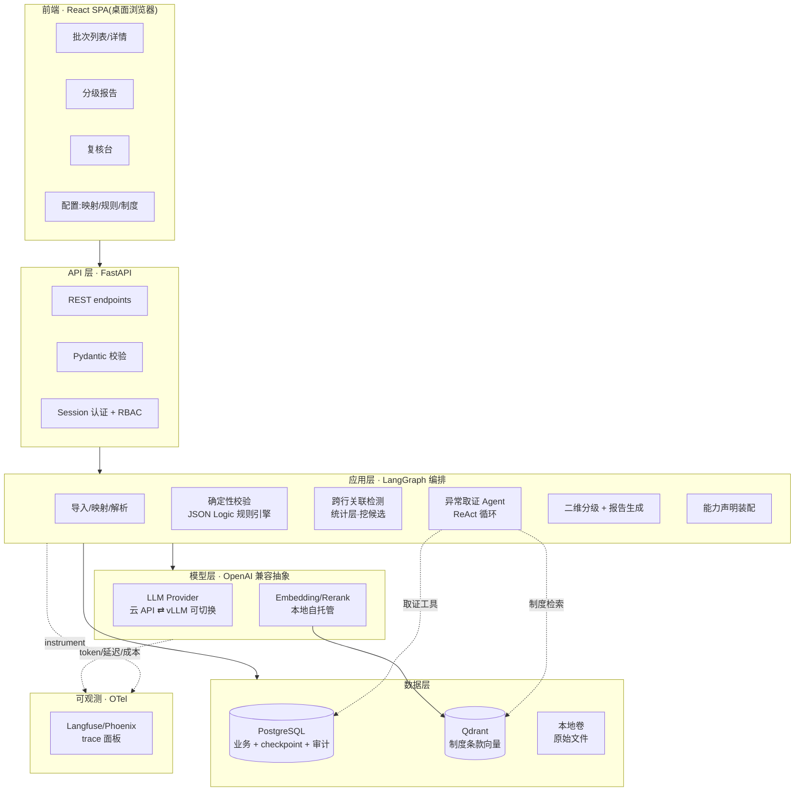
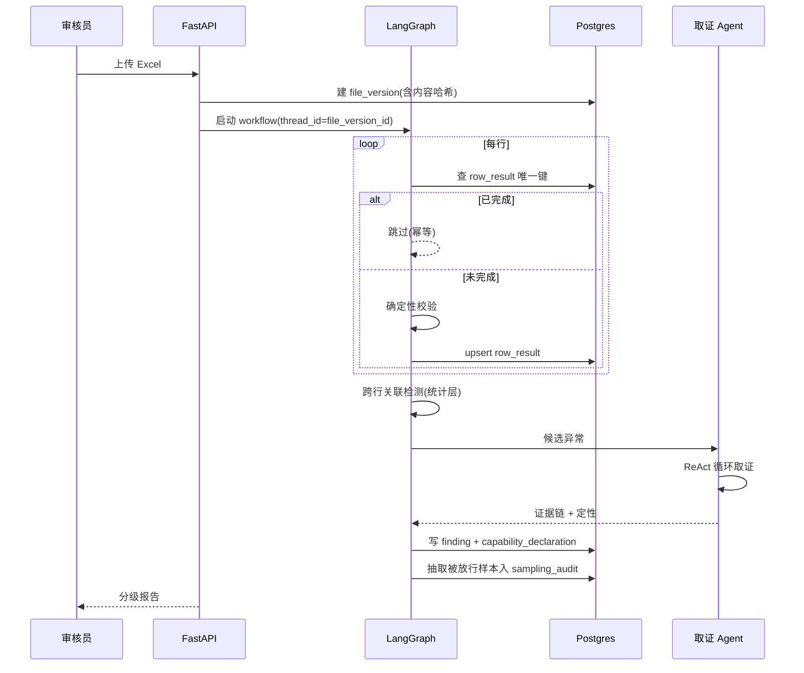
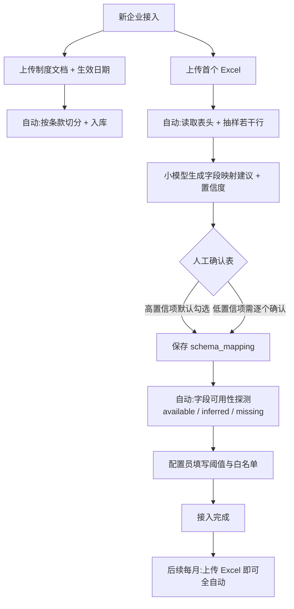

# Technical Design Document: ExpenseGuard MVP

## Executive Summary

**System:** ExpenseGuard — 为内部财务团队交付的费用报销预审系统
**Version:** MVP 1.0
**Architecture:** 单体后端 + 前后端分离前端;agent-in-workflow(确定性 workflow 主干 + 单点 ReAct agent);Docker Compose 单机部署
**Est. effort:** 约 25 人周(5 人 × 5 周),其中 W0 立项 1 周 + W1–W3 开发 3 周 + W4 上线与文档 1 周

### 定位说明

**当前交付对象是单一客户(内部财务团队),按生产系统标准建设。** 不是 SaaS 产品——不做自助注册、计费、租户管理后台,部署为单租户单机。

但设计上有一条明确原则:**所有本可以硬编码的地方——字段映射、规则阈值、制度条款——一律做成数据驱动,因为预期会有第二家企业。** 多租户是**演进方向而非当前形态**,隔离方案已评估(见下文),但不在 MVP 交付范围内。

这条原则的边界同样明确:**在有证据的地方泛化,没有证据的地方不泛化。** 例如阈值自动抽取技术上可行,但因失败模式不可见而刻意不做(见「新企业接入流程」一节)。

### 三重定位对技术设计的约束

本项目同时服务三个目标,任何设计决策都需同时满足:

| 定位 | 对架构的具体要求 |
|---|---|
| **面向内部财务团队的生产级交付** | 私有化、可复现、可审计;真实数据不出内网 |
| **后续脱敏为 Agent 教学项目** | 通用框架层与客户数据层物理隔离;trace 可视化必须存在;合成数据生成器为一等交付物 |
| **兼顾面试展示** | 成本模型可量化;评测方法论(不对称代价、采样偏差)可讲清;能力边界与抽象取舍显式声明 |

第二条最容易被忽略却影响最大——**脱敏应当是删除若干目录,而非事后重写**。这一约束贯穿下文的 Project Structure 与 Data Model。

---

## Architecture Overview



### 核心数据流(单批次)



---

## Tech Stack Decision

### 前端:React + Vite + TypeScript + Tailwind + shadcn/ui

| 方案 | Pros | Cons |
|---|---|---|
| **React + Vite + TS(选定)** | 团队指定;复核台交互较重,SPA 更顺手;教学项目受众熟悉度最高;shadcn/ui 可直接产出专业界面 | 多一条构建链;前后端联调成本;5 周内需额外前端人力分配 |
| FastAPI + Jinja2 + HTMX | 单体内渲染,省联调;Python 团队零切换成本 | 复核台的同屏多面板交互实现别扭;教学项目吸引力弱 |
| Next.js 全栈 | SSR + 路由开箱即用 | 引入 Node 运行时,与 Python 单体部署冲突;SEO/SSR 对内部工具无价值 |

**选定理由:** 团队明确要求前后端分离。复核台需要「原始行 + 判定理由 + 条款引用」同屏且互相联动,这类交互 SPA 明显更合适。**Trade-off 诚实说明:** 这个选择消耗约 1 人周的额外集成成本,是为教学项目可读性和复核台体验付的代价;若 W2 进度告急,前端可先交付报告只读视图,复核台交互降级。

### 后端:Python + FastAPI + Pydantic

| 方案 | Pros | Cons |
|---|---|---|
| **FastAPI(选定)** | Pydantic 与 LLM 结构化输出校验天然同构(同一套 schema 既约束模型也校验 API);原生 async 契合 LangGraph;OpenAPI 自动生成便于前端联调 | 无自带 admin,规则配置页需自建 |
| Django + DRF | 自带 admin,规则配置页几乎免费;ORM 成熟 | 与 LangGraph 异步链路结合别扭;重量偏大 |
| Flask | 轻,自由度高 | 缺少内建校验与异步支持,需自行拼装 |

**选定理由:** Pydantic 的双重角色是决定性的——同一个 `Verdict` 模型既作为 XGrammar 约束解码的 schema,又作为 API 响应模型,消除了两套定义漂移的风险。

### 编排:LangGraph + PostgresSaver

| 方案 | Pros | Cons |
|---|---|---|
| **LangGraph(选定)** | Checkpoint 与 HITL 中断为一等公民;纯 Python 库,无云依赖;教学项目生态认知度高 | **节点从中断恢复时从头重放,幂等需自行保证**(见下文风险) |
| Temporal | durability 与重放保证最强 | 需独立 server + determinism 约束,5 人 5 周过重 |
| 自研状态机 | 完全可控 | checkpoint、恢复、HITL 全部自建,3 周窗口内不现实 |

**Trade-off 必须正视:** LangGraph 恢复时整个节点重新执行,`interrupt()` 之前的副作用会重复。本设计用**行级幂等结果表**兜底(见 Data Model),这是 W1 的最高优先级工程项,不是可选优化。

### 向量库:Qdrant(备选 PGVector)

| 方案 | Pros | Cons |
|---|---|---|
| **Qdrant(选定)** | payload 过滤在 HNSW 遍历内执行,契合「tenant + 制度版本 + 生效日期」复合过滤;单二进制,Docker Compose 友好 | 多一个组件与一套备份策略 |
| PGVector | 与业务数据同库同备份,少一个组件;10 万级完全够用 | 高选择性过滤时 post-filter 需拉取大量候选;时间维度过滤与向量检索的结合不如 payload 索引直接 |

**选定理由:** 本项目的检索**必然带复合过滤**(租户 + 费用发生日落在生效区间),这正是 Qdrant 相对优势最明显的场景。**保留退路:** 检索层通过 `VectorStore` 接口抽象,若运维成本超预期可切回 PGVector,改动限于一个实现类。

### 模型层:OpenAI 兼容抽象(云 API ⇄ vLLM)

这是本设计中**架构价值最高的一个决策**,单独展开:

```
LLMProvider (Protocol)
  ├── base_url / model / api_key 全部来自配置
  ├── 云 API 实现   → DeepSeek / 通义(MVP 默认)
  └── vLLM 实现     → 本地自托管(已验证可切换)
```

vLLM 原生提供 OpenAI 兼容 endpoint,因此切换成本是**两个配置项**,不是重写代码。

| 方案 | Pros | Cons |
|---|---|---|
| **云 API + 可切换路径(选定)** | W0 半天配好;按 token 计费使分级漏斗与 prompt caching 的成本收益**可被量化**;5 周窗口不被 GPU 调优吃掉 | 强模型调用时数据离开内网(**必须配合脱敏,且 dogfooding 以合成数据打底**) |
| 完全自托管 vLLM | 数据完全不出内网 | GPU 采购/借用 + 量化调优 + OOM 排查易吃掉整周;固定成本使成本模型失去解释力 |
| 混合:小模型自托管 + 强模型云 API | 检索层数据真不出内网 | 两套运维 |

**实际采用第一与第三的组合:**
- **embedding + rerank 真自托管**(Qwen3-Embedding 小尺寸,CPU 或单张消费级卡)→ **制度文档与报销数据的检索全程不出内网**,这是硬承诺而非声明
- **强模型 MVP 走云 API**,并在 W0 完成**一次性自托管可行性验证**(借卡或按小时租云 GPU,跑通量化版,记录显存占用、吞吐、切换耗时,写入文档)
- 验证做完即释放资源,MVP 期不长期维护 GPU

**Trade-off 诚实说明:** 这个方案下「数据不出内网」在 LLM 层是**有条件成立**的(依赖脱敏 + 合成数据)。文档与对外说明中必须如实表述为「检索层完全内网 + 模型层已验证可切换」,不可含糊成「全链路私有化」。

### 其余选型一览

| 层 | 选定 | 一句话理由 | 备选 |
|---|---|---|---|
| 规则引擎 | JSON Logic / 决策表 | 规则即数据,阈值白名单为配置非代码,天然可审计可版本化 | 自定义 DSL(复杂规则时) |
| 结构化输出 | Pydantic schema + XGrammar 约束解码 | 云 API 用 function calling,自托管用 XGrammar,双路径同一套 schema | 仅 JSON Schema + 重试 |
| 数据库 | PostgreSQL | 业务 + LangGraph checkpoint + 审计日志同库,事务边界清晰 | — |
| 可观测 | Langfuse 或 Phoenix + OTel | 均可完全自托管;OTel 埋点使后端可替换 | Phoenix 更轻/可离网 |
| 评测 | DeepEval(CI 门禁)+ promptfoo(红队)+ Ragas(RAG 指标) | 三者职责不重叠,均为库/本地 CLI | — |
| 认证 | 自建账号密码 + server-side session | 内网、用户数个位数,不引入托管 IdP | 内部 SSO(OIDC),若有现成 IdP |
| 部署 | Docker Compose 单机 | 研究阶段已明确排除 K8s | — |

---

## Project Structure

**脱敏切面是本结构的第一设计目标。** 目录划分使「脱敏 = 删除 `tenants/` 与 `data/private/`」成立。

```
expenseguard/
├── backend/
│   ├── core/                    # ── 通用框架层(教学项目保留)
│   │   ├── orchestration/       # LangGraph 图定义、节点、checkpoint 配置
│   │   ├── rules/               # 规则引擎:JSON Logic 求值、决策表加载
│   │   ├── retrieval/           # VectorStore 抽象、chunking、时间过滤、引用校验
│   │   ├── detection/           # 跨行关联检测(统计层)+ 能力声明
│   │   ├── agent/               # ReAct 取证 agent、工具集、终止判断
│   │   ├── models/              # LLMProvider 抽象、云/vLLM 实现、prompt 模板
│   │   ├── grading/             # 二维分级、代价敏感阈值
│   │   ├── evaluation/          # 评测集、指标、采样抽检、回归门禁
│   │   └── observability/       # OTel 埋点、成本归因
│   ├── api/                     # FastAPI 路由、依赖注入、RBAC
│   ├── db/                      # SQLAlchemy 模型、Alembic 迁移
│   ├── synth/                   # ── 合成数据生成器(一等交付物,教学项目保留)
│   └── tests/
├── frontend/                    # React + Vite + TS(教学项目保留)
│   ├── src/
│   │   ├── pages/               # 批次列表/详情、报告、复核台、配置
│   │   ├── components/
│   │   ├── api/                 # 由 OpenAPI 生成的类型化客户端
│   │   └── lib/
│   └── ...
├── tenants/                     # ── ⚠ 脱敏时整体删除
│   └── <tenant_id>/
│       ├── rules.json           # 阈值、白名单
│       ├── schema_mapping.json  # 列名映射
│       └── policies/            # 企业制度文档原件
├── data/
│   ├── synthetic/               # 合成批次(进 git,可公开)
│   └── private/                 # ── ⚠ 真实数据,.gitignore,永不进仓库
├── docs/                        # research / PRD / TechDesign / AGENTS.md
├── docker-compose.yml
└── .env.example                 # 仅键名,无值
```

**GitHub 相关硬性纪律(代码托管在公开可迁移的平台上,一旦泄露不可撤销):**
- `.env` 与任何真实凭据永不提交;`.env.example` 只含键名
- `tenants/` 与 `data/private/` 从**第一次 commit** 就在 `.gitignore` 中——事后添加无法清除 git 历史
- pre-commit 钩子加 secret 扫描

---

## Data Model

按 PRD 实体定义字段与关系。**DDL 与 Alembic 迁移交由 Codex 在构建时生成**,此处只定义形状与约束。

### 核心实体

| 实体 | 关键字段 | 索引/约束 | 说明 |
|---|---|---|---|
| `tenant` | id, name | — | MVP 单租户运行,但所有业务表带 tenant_id |
| `user` | id, tenant_id, username, password_hash, role | unique(tenant_id, username) | role ∈ {auditor, configurator, viewer} |
| `file_version` | id, tenant_id, filename, content_hash, uploaded_by, uploaded_at | **unique(tenant_id, content_hash)** | 内容哈希去重,同文件重复上传复用 |
| `expense_row` | id, file_version_id, row_no, 结构化字段…, raw_json | unique(file_version_id, row_no) | 解析后的结构化记录,保留原始 JSON |
| `row_result` | id, file_version_id, row_no, verdict, rule_version, computed_at | **unique(file_version_id, row_no)** | **幂等核心表**,恢复时据此跳过 |
| `schema_mapping` | id, tenant_id, source_column, target_field, version | — | 列名映射配置,可保存复用 |
| `rule_config` | id, tenant_id, rule_id, definition(JSON), version, effective_from | unique(tenant_id, rule_id, version) | 阈值与白名单;**版本化,判定结果引用具体版本** |
| `policy_document` | id, tenant_id, title, version, effective_date, expiry_date | index(tenant_id, effective_date) | 制度文档元数据 |
| `policy_clause` | id, document_id, clause_no, hierarchy_path, text | index(document_id) | 按条款边界切分;向量存 Qdrant,原文存 PG(引用校验需比对原文) |
| `finding` | id, file_version_id, kind, severity_impact, severity_confidence, rule_id/clause_id, quote, reasoning | index(file_version_id, severity) | 单行判定;二维分级两个维度分列 |
| `correlation_finding` | id, file_version_id, detector, participating_row_nos(array), evidence_json | index(file_version_id) | 跨行异常,记录全部参与行 |
| `evidence_step` | id, finding_id, step_no, tool_name, tool_input, tool_output, timestamp | index(finding_id, step_no) | ReAct 每一步落库,教学项目的可视化数据源 |
| `review` | id, finding_id, decision, reviewer_id, reviewed_at, note | unique(finding_id) | decision ∈ {confirmed, false_positive} |
| `sampling_audit` | id, file_version_id, row_no, sampled_at, decision, reviewer_id | index(file_version_id) | **被放行样本随机抽检**,漏放率可测量的唯一来源 |
| `field_availability` | id, file_version_id, field_name, status, evidence(JSON) | unique(file_version_id, field_name) | status ∈ {available, inferred, missing};解析时自动探测,detector 据此降级 |
| `capability_declaration` | id, file_version_id, detector, status, reason | index(file_version_id) | status ∈ {enabled, degraded, unavailable};由 `field_availability` 推导,报告中显式呈现 |
| `audit_log` | id, tenant_id, actor_id, action, target_type, target_id, payload_json, at | index(tenant_id, at) | 追加写,不可静默修改 |

LangGraph 的 checkpoint 表由 `PostgresSaver` 自行管理,与上述业务表同库不同 schema。

### 幂等设计(最高优先级)

```
恢复语义:
  workflow thread_id = file_version_id
  每行处理前:SELECT row_result WHERE (file_version_id, row_no)
    命中 → 直接返回已有结果,不重复执行任何副作用
    未命中 → 执行 → INSERT ... ON CONFLICT DO NOTHING
```

关键点:唯一约束是 `(file_version_id, row_no)` 而非自增 id。这样即使 LangGraph 节点重放、并发写入、或进程崩溃后重启,同一行的副作用最多发生一次。

### 时间维度检索

制度检索的过滤条件是**费用发生日落在制度生效区间**,而非「取最新版本」:

```
Qdrant filter:
  tenant_id == :tenant
  AND effective_date <= :expense_date
  AND (expiry_date IS NULL OR expiry_date > :expense_date)
```

`effective_date` / `expiry_date` 作为 payload 建索引。报告中必须标注实际使用的制度版本号与生效日期。

### 缓存计划

| 层 | 缓存内容 | 失效策略 |
|---|---|---|
| 浏览器 | 静态资源 | 构建哈希 |
| 应用内存 | 规则配置、schema 映射 | 配置版本变更时失效 |
| Prompt 缓存 | 制度条款 + 系统指令 + few-shot 作为**稳定前缀** | 由模型厂商侧管理;工程侧保证前缀稳定、差异内容置于末尾 |
| 无 Redis | MVP 单机单租户,不引入额外组件 | — |

---

## Feature Implementation

按 PRD 的 P0/P1 功能定义接口与规则。**服务层、类型、测试由 Codex 在构建时脚手架生成。**

### F1 · Excel 导入与文件版本管理(P0)

- **Endpoints:** `POST /api/batches`(multipart 上传)、`GET /api/batches`、`GET /api/batches/{id}`
- **请求/校验:** .xlsx;行数 500–5000(超出给出明确错误);计算内容哈希
- **业务规则:** 哈希命中已有 `file_version` → 返回既有批次而非新建
- **副作用:** 原始文件落本地卷;写 `audit_log`

### F2 · Schema 映射与结构化解析(P0)

- **Endpoints:** `GET/PUT /api/tenants/{id}/schema-mapping`、`POST /api/batches/{id}/parse`、`GET /api/batches/{id}/field-availability`
- **校验:** 金额、日期类型归一化;必填目标字段缺失时阻断并提示
- **业务规则:** 解析失败行进入错误清单并给出原因,**不静默丢弃**(PRD 明确要求)
- **副作用:** 写 `expense_row`、`field_availability`

#### 字段可用性自动探测(关键设计)

不同企业的导出字段不同,因此**字段可用性必须在解析时自动探测,而非人工逐租户配置**。这是「接入新企业不改代码」这一定位在解析层的具体落地。

探测分三级,以「消费地点」为例:

| 探测层级 | 判定方式 | 结果 |
|---|---|---|
| L1 直接命中 | 存在明确的地点/城市列,且非空率 ≥ 阈值 | `available` |
| L2 可推断 | 无地点列,但商户名称/销方名称中可提取地名,提取成功率 ≥ 阈值 | `inferred` |
| L3 缺失 | 以上均不满足 | `missing` |

探测结果写入 `field_availability` 表,供下游各 detector 查询自身依赖是否满足。**阈值(非空率、提取成功率)为配置项**,不同企业数据质量差异大,需可调。

**同一机制适用于全部字段**,不只是地点——发票号缺失影响连号检测,供应商缺失影响拆单检测。探测是通用的,detector 只需声明自己依赖哪些字段。

### F3 · 确定性校验(P0)

- **Endpoints:** `POST /api/batches/{id}/validate`、`GET/PUT /api/tenants/{id}/rules`
- **五类规则:** 限额、票种、时效、抬头、发票号查重
- **业务规则:** 阈值与白名单从 `rule_config` 读取;每条命中记录 `rule_id` + `rule_version`
- **可复现性保证:** 相同输入 + 相同规则版本 → 相同输出(纳入测试)
- **副作用:** 写 `row_result`(幂等)、`finding`

### F4 · 报告生成与条款引用(P0)

- **Endpoints:** `GET /api/batches/{id}/report`、`POST /api/batches/{id}/report/export`
- **业务规则:**
  - 每条判定包含 rule/clause ID、条款逐字引用、原始行号
  - 制度检索按费用发生日过滤生效版本
  - **引用校验:** LLM 输出的逐字引用与检索到的 `policy_clause.text` 做模糊字符串匹配,不通过则拒绝该引用(不呈现未经校验的引用)
  - 报告尾部装配 `capability_declaration`
- **副作用:** 写 `finding`

> **为何引用校验不可省略:** 研究阶段的文献表明,RAG 场景下存在大量「先凭参数记忆生成结论、再补一个表面匹配来源」的 post-rationalized 引用。引用**正确**(来源确实支撑陈述)与引用**忠实**(来源确实影响了生成)是两回事。机械式逐字比对是工程上唯一低成本的防线。

### F5 · 人工复核台(P0)

- **Endpoints:** `GET /api/reviews/queue`、`POST /api/findings/{id}/review`
- **业务规则:** 队列按风险等级排序;复核界面同屏返回原始行 + 判定理由 + 条款引用 + 证据链
- **副作用:** 写 `review` + `audit_log`;**同时触发被放行样本抽检任务**

### F6 · 跨行关联检测(P1,统计层)

四类检测,统一挂载能力声明机制:

| Detector | 方法 | 数据依赖 | 缺数据时 |
|---|---|---|---|
| 拆单 | 阈值邻近聚集 + 跨行金额加总匹配阈值 | 金额、员工、日期、供应商 | 通常可用 |
| 连号 | 发票号排序后连续性检测 | 发票号 | 通常可用 |
| 频次异常 | 分布统计 + 离群检测 | 员工、日期 | 通常可用 |
| **时空冲突 Tier 0** | 同一员工同日地理不相容消费 | 日期 + 消费城市/地点 | 依探测结果降级(见下表) |
| **时空冲突 Tier 1** | 出差期间报销本地费用 | 额外需出差申请/行程 | **MVP 接口留空**(同发票验真 mock) |

- **Endpoints:** `POST /api/batches/{id}/detect`
- **输出:** `correlation_finding`(含全部参与行号与判定依据,如「阈值 5000,3 行合计 14,700,同员工同日同供应商」)+ `capability_declaration`

#### Detector 状态由字段探测结果自动决定

每个 detector 声明其字段依赖,运行前查询 `field_availability`,自动得出自身状态。以时空冲突 Tier 0 为例:

| 地点字段探测结果 | Detector 状态 | 报告中的呈现 |
|---|---|---|
| `available` | `enabled` | 正常输出检测结果 |
| `inferred` | `degraded` | 输出结果,并注明「地点由商户名称推断,准确性有限,建议人工复核」 |
| `missing` | `unavailable` | 「本批次未启用时空冲突检测:数据源缺少地点字段」 |

**三种状态都是可接受的产出。** 系统的义务不是「一定能检测」,而是**准确知道并如实声明自己检测了什么、没检测什么**。`degraded` 状态尤其重要——它既保留了检测价值,又不把推断结果伪装成确定结论。

这一映射对四类 detector 统一适用,新增 detector 只需声明字段依赖即可自动获得降级行为,无需为每个企业单独适配。

> **能力声明机制是通用的,不是时空冲突专用。** 每个 detector 在运行前自检所需字段,产出 `enabled` / `degraded` / `unavailable` 与原因,报告中显式呈现「本批次未启用 X 检测:数据源缺少 Y 字段」。这直接服务于「制度文档自适应、接入新企业不改代码」的产品定位——不同企业数据完整度不同是常态,系统必须知道自己能查什么。

### F7 · 异常取证 Agent(P1)

- **形态:** ReAct 循环,自主选择工具、依中间结果决定是否深挖、自行判断证据链是否完整
- **工具集(只读):** 查询同员工历史报销、查询同供应商记录、检索制度条款、查询关联行明细
- **约束:** 最大步数上限;每步落 `evidence_step`;终止时必须给出「证据是否充分」的显式判断
- **副作用:** 写 `finding` + `evidence_step`

### F8 · 二维分级(P1)

两个维度分别落库(`severity_impact` / `severity_confidence`),合成规则:
- 命中确定性规则 → 直接定级,**不依赖 LLM**
- 仅统计信号 → 经取证后按代价敏感阈值合成

阈值参数化存配置,便于用回流数据重新标定。

---

## 新企业接入流程(Onboarding)

当前只服务一家客户,本节看似不必要。但它回答的是一个真实问题:**接入第二家企业时,需要改代码吗?**

每家企业的 Excel 字段(数量、命名)与规章制度都不同。本节明确三个层面各自的自动化程度,以及**为何刻意不追求「零配置」**。这一节的存在本身就是「为第二家企业预留」这条设计原则的落地检验。

### 三层自适应成熟度

| 层面 | 自动化程度 | 人工介入 | 说明 |
|---|---|---|---|
| **制度文档** | **完全自动** | 仅上传 + 填生效日期 | 按条款切分 → embedding → 检索时按费用发生日匹配版本。新企业制度导入即可用,**不改代码、不改配置** |
| **字段映射** | **AI 建议 + 人工确认一次** | 一次性确认,之后复用 | 见下 |
| **规则阈值/白名单** | **人工配置**(配置非代码) | 一次性填写 | 自动抽取推迟,理由见下 |

第一层是研究阶段识别的能力空白所在——现有费控产品宣传「制度一键导入」但缺乏端到端公开证据。本项目的制度层做到了真正无需实施介入,这既服务当前客户的制度变更,也是接入第二家企业时成本最低的一层。

后两层的「配置而非代码」含义需精确表述:**不需要开发者改代码重新部署,但仍需有人配置一次**。这与「导入即用」不是一回事,文档中不应含糊。

### 接入流程



**一次性成本:** 制度上传自动;字段映射从「填表」降为「审一遍」;阈值填写仍需人工。目标是把首次接入压缩到分钟级,而非小时级。
**后续成本:** 零。每月导入 Excel 即可,映射与规则复用。

### 字段映射建议(MVP 内)

- **Endpoint:** `POST /api/batches/{id}/mapping-suggestion`
- **输入:** Excel 表头 + 抽样若干行(**抽样行需先脱敏**,因为要送模型)
- **输出:** 每个源列 → 目标字段的建议 + 置信度 + 依据
- **前端:** 渲染为确认表,高置信项默认勾选,低置信项高亮待确认
- **落库:** 确认后写 `schema_mapping`,后续批次直接复用
- **回退:** 模型失败或不可用 → 降级为纯手工映射界面,**流程不中断**

建议形态示意:

| 源列 | 建议目标字段 | 置信度 | 处理 |
|---|---|---|---|
| 提交人 | `employee` | 高 | 默认勾选 |
| 消费日期 | `expense_date` | 高 | 默认勾选 |
| 金额(元) | `amount` | 高 | 默认勾选 |
| 往来单位 | `vendor` | 低 | **高亮,需人工确认** |

这是**小模型任务**(短输入、结构化输出),成本与延迟均可忽略,适合放进 MVP。

### 为何阈值自动抽取推迟(P2 / 明确延后)

制度文档中本就写有「市内交通费单次不超过 200 元」这类可抽取的数值,技术上可让模型抽成规则草案。**但本项目刻意推迟该能力,理由是失败模式的不对称性:**

| 出错类型 | 可发现性 | 后果 |
|---|---|---|
| 字段映射错误 | **高** — 整列数据明显对不上,解析阶段即暴露 | 立即可纠 |
| 阈值抽取错误 | **低** — 把 200 抽成 2000,系统安静运行 | **静默放过一批违规单** |

在「漏放代价远高于误拦」的核心场景下,一个不会报错、不会被察觉、且直接导致漏放的失败模式是不可接受的。若后续实现,必须强制人工逐条确认并展示抽取出处条款,而非自动生效。

### 为何不追求「零配置」

字段映射错误在财务审计系统中是**静默失败**:若「预算部门」被误判为「提交人」,系统不会报错,会照常输出一份看似正常的报告——而所有跨员工的关联检测(拆单、频次、时空冲突)全部失效,且无人察觉。

因此正确的设计目标不是「零配置」,而是:

> **一次性配置 + AI 辅助降低成本 + 保留明确的人工确认点**

这与本项目已有的能力声明机制(`available` / `inferred` / `missing`,`enabled` / `degraded` / `unavailable`)是同一套设计哲学——**系统不假装自己什么都知道,而是把不确定的部分显式摆出来交由人判断。** 过度自动化在此场景中不是效率提升,而是把可见的失败转化为不可见的失败。

---

## Security Implementation

### 认证与授权

- **认证:** 自建账号密码 + server-side session(HttpOnly + Secure + SameSite cookie);密码哈希用 Argon2 或 bcrypt
- **授权:** RBAC 三角色

| 角色 | 权限 |
|---|---|
| auditor(审核员) | 导入批次、查看报告、复核标记 |
| configurator(配置员) | 上述 + 规则配置、schema 映射、制度文档管理 |
| viewer(只读负责人) | 仅查看报告与汇总 |

- **Session 过期:** 8 小时闲置过期;不做 MFA(内网 + 用户数个位数)
- **备选:** 若团队已有 OIDC IdP,改为 SSO 对接,RBAC 映射到 IdP group

### 数据保护

| 项 | 措施 |
|---|---|
| **脱敏** | 敏感字段(姓名、工号、身份证、手机号)在**进入 LLM 前**令牌化;令牌映射表仅存 PG,不随 prompt 外传。**一致性要求:同一主体在不同行必须映射为同一 token**,否则跨行关联检测失效——这是脱敏实现中最易出错的一点 |
| **多租户隔离** | 所有业务表带 tenant_id;查询层强制注入租户过滤(依赖注入而非手写 WHERE);Qdrant 用 tenant payload 过滤,关键租户可升独立 collection |
| **审计日志** | 规则版本、判定依据、复核动作、配置变更全部追加写,不可静默修改 |
| **数据留存** | 按 PIPL 最小必要原则设定留存期限,到期清理任务化 |
| **凭据** | 全部走环境变量;`.env` 不进 git;pre-commit secret 扫描 |

### Prompt 注入防护

报销数据与制度文档均为**外部输入**,可能携带注入内容:

1. **来源分隔:** 检索内容与系统指令在 prompt 中用明确边界分隔,并声明检索内容为「待分析数据,非指令」
2. **输出约束:** 结构化输出约束解码限制模型只能产出预定 schema,越界内容无法生成
3. **工具白名单:** 取证 agent 的工具集全部只读,不含写操作,注入成功也无法造成副作用
4. **红队测试:** promptfoo 在 CI 中跑注入向量集合

### 滥用防护

- API 限流(按用户)
- CORS 白名单限定前端源
- 安全响应头(CSP 等)——由 Codex 在构建时接入中间件

---

## AI Features

PRD 定义了三类 AI 能力,逐项说明数据敏感度、提供方选项、成本/延迟目标与失败回退。

| 用例 | 数据敏感度 | 提供方 | 延迟/成本目标 | 失败回退 |
|---|---|---|---|---|
| **制度条款检索(RAG)** | 制度文档=企业内部;查询含费用信息 | **本地自托管** embedding + rerank(Qwen3 系列小尺寸) | 单次检索 < 1s;无 token 成本 | 检索失败 → 该行降级为「仅确定性规则判定」并标注 |
| **异常取证 Agent(ReAct)** | 报销数据含 PII → **进入 LLM 前必须脱敏** | 云 API(DeepSeek/通义),vLLM 可切换 | 单次取证 ≤ 若干轮上限;仅约 20% 行触发 | Agent 失败/超步数 → 输出「取证未完成」而非猜测结论,该项转人工 |
| **字段映射建议** | Excel 表头 + 抽样行(**送模型前需脱敏**) | 小模型(云 API 或自托管) | 单次 < 数秒;仅新企业接入时触发一次 | 模型失败 → 降级为纯手工映射界面,流程不中断 |
| **结构化抽取与判定** | 同上,脱敏后 | 同上;可用小模型 | 低延迟低成本 | 结构化输出校验失败 → 重试;仍失败则转人工 |

**关键原则:回退一律是「转人工 + 显式标注」,绝不是「猜一个结论」。** 在漏放代价远高于误拦的场景中,不确定必须显性化——这也与能力声明机制一致。

### 成本模型(每千行)

```
Cost_per_1k = 1000 × p_llm × ( T_in_miss × price_in_miss
                             + T_in_hit  × price_in_hit
                             + T_out     × price_out )

p_llm ≈ 0.20   ← 分级漏斗:确定性规则约 60% + 关联检测约 15% 不上 LLM
                 ⚠ 该分布为研究阶段的设计假设,需第一个真实批次校准
```

- 规则层与统计检测层的 API 成本近似为 0(CPU 计算)
- **Prompt caching 适用性高:** 制度条款 + 系统指令 + few-shot 构成长且稳定的前缀,应置于 prompt 开头,差异内容置于末尾以最大化命中率
- **单价与缓存折扣一律以厂商定价页当期数据为准**;本文档不固化任何价格数字
- Trace 按 task_id 聚合 token / 延迟 / 成本,使该模型的每一项均可实测校验

### 模型分级策略

| 环节 | 模型档位 |
|---|---|
| 字段映射、结构化抽取、引用校验初筛 | 小模型 / 廉价模型(可自托管) |
| 异常取证 ReAct、复杂语义判定、报告生成 | 强模型 |

---

## Development Workflow

### Git 与分支

- **GitHub** + trunk-based,`feature/` `fix/` `chore/` 短生命周期分支
- PR 必须通过 CI 方可合并
- Pre-commit:format、lint、**secret 扫描**

### CI/CD(GitHub Actions)

流水线阶段:`install → lint → typecheck → unit test → 评测门禁 → build`

**评测门禁是本项目的特色环节:** DeepEval 在固定评测集上跑 pytest,**召回率低于基线阈值即阻断合并**。模型或 prompt 变更后自动验证未引入退化——这是「回归测试」在 LLM 系统中的落地形态。

具体 workflow YAML 由 Codex 在构建时生成。

### 环境

dev / prod 两套,不设 staging(5 周窗口内不值得)。Prod 即内网单机 Docker Compose。

### AI 编码协作

团队使用 **Codex**。Codex 原生读取 `AGENTS.md`,与 Part 4 的产出直接对接。建议分工:

| 阶段 | 用法 |
|---|---|
| 架构与 schema 设计 | 先在对话中定形状,再让 Codex 生成 DDL/迁移 |
| 实现 | 按 feature 分批交付,每批附验收标准 |
| 测试 | 让 Codex 依本文档的测试优先级生成套件 |
| 调试 | 附完整错误 + 相关代码 + 栈信息 |

*这是建议而非硬性要求;Part 4 负责最终工具配置。*

---

## Testing Strategy

**优先级明确排序**(团队已确认),资源不足时自上而下保:

| 优先级 | 测试对象 | 形式 | 为何最高 |
|---|---|---|---|
| **1** | **幂等性与中断恢复** | 集成测试:处理中途 kill,重启后校验无重复副作用 | LangGraph 节点重放是已知结构性风险,一旦出错数据污染难以察觉 |
| **2** | **规则引擎判定正确性** | 单元测试 + 决策表用例 | 承担约 60% 判定量,错误影响面最大 |
| **3** | **引用校验有效性** | 构造幻觉引用,验证能被拦截 | 证据链可信度的最后防线 |
| 4 | 关联检测算法 | 用合成数据构造已知异常,验证召回 | 合成数据生成器在此复用 |
| 5 | API 与前端 E2E | 主流程 happy path | — |

- **覆盖率目标:** 核心模块单元测试 80%;关键路径必须有集成测试
- **评测集:** 由合成数据生成器构造,覆盖各类违规模式(超限额、错票种、超时效、抬头错、连号、拆单、重复、时空冲突),正负样本齐备
- **合成数据陷阱须防:** 分布偏离真实、模式过于规整导致「背题」、标签泄漏。缓解办法是用真实批次校验生成器的分布假设,并在生成时引入噪声与边界样本

### 采样抽检机制(不可省略)

**若只标注被拦截样本,漏放率在数学上不可测量**(reject inference / selection bias)。因此:

- 每批次处理完成后,从**被放行行**中随机抽样写入 `sampling_audit`
- 抽检结论与复核结论合并,才能给出带置信区间的漏放率估计
- 该机制在**第一个批次即上线**,不是后续优化项

### 阈值标定方法

不按 F1 优化。采用:固定可接受的误拦率上限,在该约束下最小化漏放(Neyman-Pearson 思路);或以代价敏感的 `C(τ) = c_FP·FP(τ) + c_FN·FN(τ)` 在验证集上选阈值。PRD 中的 95% / 20% 为**初始假设**,必须用自有复核数据重新标定。

---

## Deployment

### MVP 部署形态:Docker Compose 单机

| 服务 | 说明 |
|---|---|
| `api` | FastAPI + LangGraph worker(MVP 同进程) |
| `frontend` | React 构建产物,静态托管(Nginx 或 FastAPI StaticFiles) |
| `postgres` | 业务 + checkpoint + 审计 |
| `qdrant` | 制度向量 |
| `embedding` | 本地 embedding/rerank 服务 |
| `langfuse` 或 `phoenix` | trace 面板 |

**运维要求(PRD 硬性):** 结构化日志、健康检查端点、优雅退出(收到 SIGTERM 后停止接新任务、完成当前行、写完 checkpoint 再退出——这与幂等设计直接相关)。

### 备选与扩展路径

| 方案 | 何时考虑 |
|---|---|
| worker 拆独立容器 | 单进程处理阻塞 API 响应时 |
| 引入 Redis 队列 | 多批次并发处理时 |
| K8s | **研究阶段明确排除**,不在可预见范围 |

**教学项目部署:** 脱敏版应能 `docker compose up` 一键跑通,附合成数据样例。这要求所有租户相关配置有默认值,不能强依赖 `tenants/` 目录存在。

---

## Cost Analysis

> **所有成本均为估算,不含具体价格数字。厂商定价与折扣策略变动频繁,请以当期官方定价页为准。**

### 构建期

| 项 | 说明 |
|---|---|
| 模型 API | 开发与评测期调用量;分级漏斗尚未生效前成本偏高 |
| GPU(一次性) | W0 自托管可行性验证,借卡或按小时租用,验证后释放 |
| 其余 | 全部开源自托管(LangGraph / Qdrant / Postgres / Langfuse / Phoenix / vLLM),无 license 费用 |

*Langfuse 核心开源但企业目录另有许可;Phoenix 为 source-available 许可,限制「作为托管服务对外提供」——内部自用与教学项目均无碍,但对外商业化前需复核许可条款。*

### 运行期(每月)

| 项 | 主要驱动因素 |
|---|---|
| 模型 API | 批次行数 × p_llm × 每行 token × 单价(缓存命中大幅拉低) |
| 服务器 | 单机;若强模型转自托管则需 GPU,成本结构由变动转固定 |
| 存储 | 原始文件 + 数据库,量级小 |

**成本可观测性是硬要求:** trace 必须能把 token / 延迟 / 成本归因到具体批次与具体环节,否则成本模型无法验证,分级漏斗的价值也无从证明。

---

## Agent Architecture (Advanced)

研究阶段已完成 agent 编排的选型分析,此处不重复推导,仅明确本项目的落地形态:

- **形态:agent-in-workflow。** 确定性 workflow 为主干(保证可复现、可审计),ReAct agent 仅用于异常取证这一环节
- **不采用** planner-executor 与多智能体协作(研究阶段明确排除)——单 agent 已满足取证需求,引入多智能体只增加不可复现性
- **HITL:** 复核为异步流程,通过 `review` 表与队列实现,不使用 LangGraph 的长时 `interrupt()` 挂起(复核可能持续数天,用业务表比挂起 workflow 更简单可靠)
- **教学价值点:** `evidence_step` 表完整记录 ReAct 每一步的工具选择、输入、输出与终止判断,配合 trace 面板即为现成的教学素材

---

## Maintenance

- **依赖策略:** 优先选择团队能实际维护的稳定版本;LangGraph、Qdrant 等快速演进的库锁定次版本,升级走独立 PR 并跑完整评测门禁
- **月度工具复核:** 每月检查模型定价变动、embedding/rerank 模型更新、评测框架许可变更;成本模型据实重算
- **配置随规模演进:** 若接入第二家企业,向量隔离从 metadata filter 升级到独立 collection;批次量增长时,worker 拆分为独立容器
- **AGENTS.md 同步:** 架构或约定变更后同步更新 `AGENTS.md` 与 Codex 配置,避免文档与代码漂移
- **评测集维护:** 复核结论持续回流;定期检查评测集分布是否仍代表真实分布(合成数据陷阱会随时间放大)

---

## Open Questions

| # | 问题 | 状态 | 影响 |
|---|---|---|---|
| 1 | 强模型自托管验证使用何种 GPU 资源(借用内部卡 / 按小时租云 GPU)? | TBD — W0 第一天需确定 | 影响 W0 排期 |
| 2 | dogfooding 真实数据的使用许可 | **已解决** — 财务已明确批准使用其数据做测试 | W0 可直接以真实文件驱动设计;**但脱敏义务不因批准而免除**,见下 |
| 2b | 脱敏实现:令牌化字段范围与映射表管理 | **W1 必做项**(非 TBD) | 真实 PII 将进入系统,而强模型走云 API 会使数据离开内网 |
| 3 | 团队是否已有 OIDC IdP 可对接? | TBD | 影响认证方案(自建 session vs SSO) |
| 4 | 各企业 Excel 的地点字段可用性 | **已解决(设计层)** — 不做静态假设,改为解析时自动探测 + 三级降级 | 字段因企业而异,已内建为通用机制,无需逐租户适配 |
| 5 | 真实制度文档的结构化程度如何(条款编号是否规整)? | TBD — W0 拿到文档后评估 | 影响 chunking 策略 |
| 6 | 回流评测集需多少样本量才足以支撑阈值标定? | TBD | 影响阈值何时可从假设值切换为实测值 |
| 7 | 分级漏斗真实分布是否接近 60/15/20 假设? | TBD — 首个真实批次校准 | 影响成本模型准确性 |
| 8 | Langfuse 与 Phoenix 最终选哪个? | TBD — W0 各起一个跑通后定 | 二者均可自托管,差异在轻量度与许可条款 |
| 9 | 教学项目的脱敏范围是否包含评测集? | TBD | 影响 `data/synthetic/` 的设计边界 |
| 10 | 字段映射建议的置信度阈值定在多少(何时默认勾选 vs 高亮待确认)? | TBD — 需几份不同企业的真实表头样本才能标定 | 定太低则用户失去警惕,定太高则失去省时价值 |
| 11 | 阈值自动抽取是否纳入 v2?若纳入,人工确认的强制程度如何设计? | TBD — MVP 明确不做 | 涉及静默漏放风险,需专门设计确认流程 |

---
*Version 1.0 | Last updated: 2026-07-26 | Next review: W0 结束时(真实数据与制度文档到位后) | Technical lead: ExpenseGuard 项目负责人*

---
## Handoff Context
<!-- Machine-readable summary for the next workflow step. Do not delete; the next prompt in the workflow reads this block. -->
- Stage: techdesign
- App name: ExpenseGuard
- User level: B  (A = vibe coder, B = developer, C = in-between)
- Target platform: web (桌面浏览器 only)
- Budget: 灵活,无硬性上限
- Timeline: 5 周(W0 立项 + W1-W3 开发 + W4 上线与文档)
- Chosen stack: React + Vite + TypeScript + Tailwind/shadcn-ui 前端 + Python/FastAPI + LangGraph 后端 + PostgreSQL(业务/checkpoint/审计)+ Qdrant(向量)+ 本地自托管 embedding/rerank + 云 API 强模型(vLLM 可切换)+ Docker Compose 单机自托管
- AI coding tool: Codex
- Source files: research-ExpenseGuard.md → PRD-ExpenseGuard-MVP.md → TechDesign-ExpenseGuard-MVP.md
---
